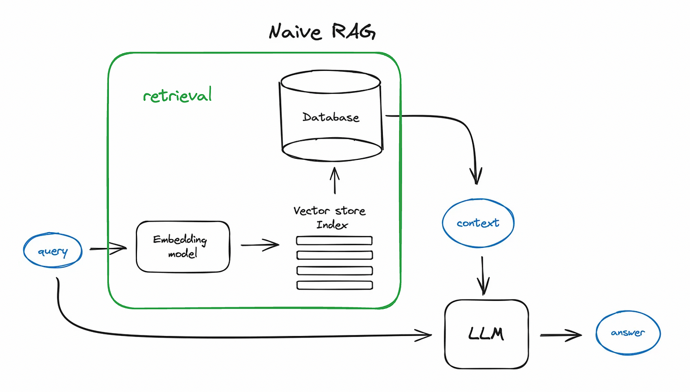
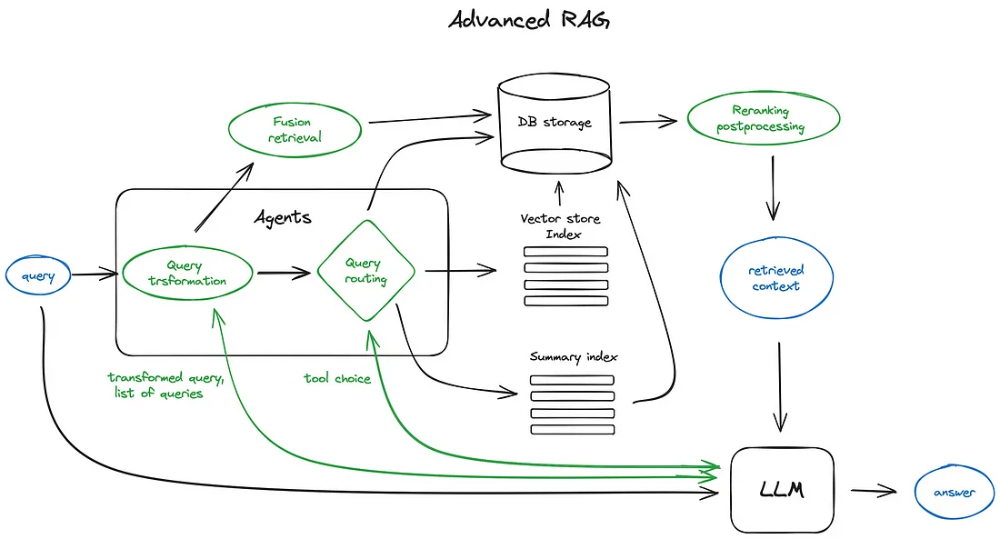

# 🎸 RAG and ROLL with LlamaIndex - Hands-on Tutorial

> 🎓 Learn RAG implementation with hands-on examples and step-by-step guidance

## 📚 What is RAG?

Retrieval-Augmented Generation (RAG) supercharges LLMs by combining them with external knowledge retrieval. Think of it as giving your AI a searchable knowledge base to reference before responding!

    
    

## 🎯 What You'll Master

| Topic           | Description                        |
| --------------- | ---------------------------------- |
| Setup           | Configure LlamaIndex environment   |
| Data Processing | Build document loaders and indexes |
| Retrieval       | Create efficient search systems    |
| Query Engines   | Implement smart query processing   |
| More            | ...                                |
| Real Examples   | Practical use cases                |

## 📋 Prerequisites

-   Python 3.8+
-   Basic understanding of LLMs
-   Notebooks familiarity
-   OpenAI API key (optional, you can also use local models)

## 🚀 Getting Started

-   📦 **Lesson 01**: Learn how to load and ingest data, and create your first index.
-   📦 **Lesson 02**: Discover how to filter and rerank chunks, and build your first chat engine.
-   📦 ... doing

## 📄 License

MIT Licensed. See LICENSE for details.

 
    <strong>Happy RAG and ROLL! 🎸</strong>

