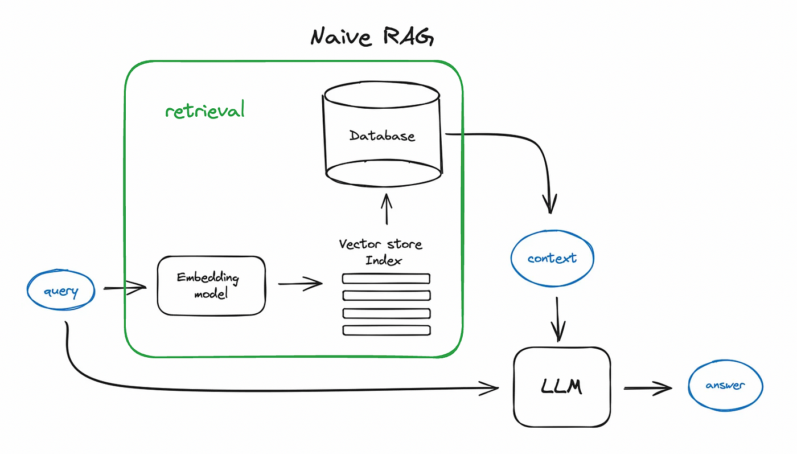
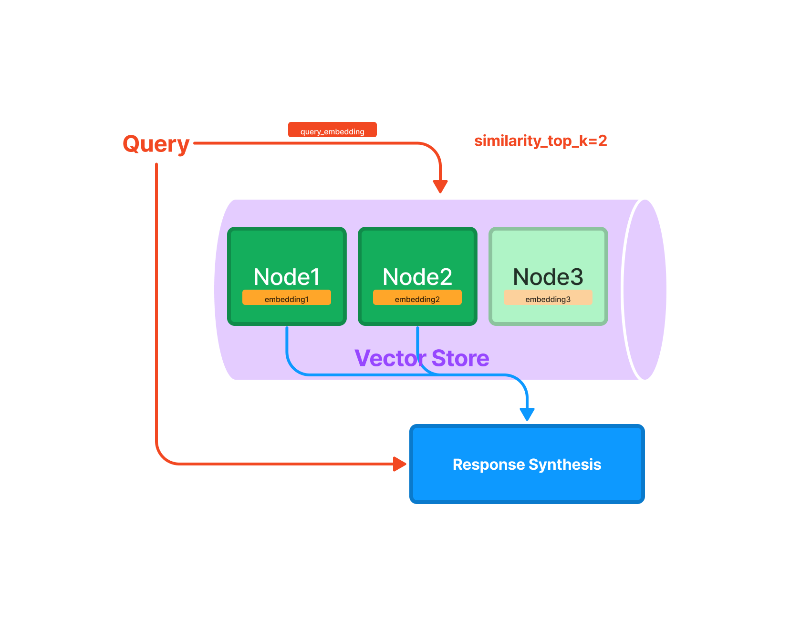

# Lesson 01: Introduction to RAG with LlamaIndex

In this lesson, you'll:

-   Learn how to set up LlamaIndex
-   Load documents and process them
-   Create chunks and nodes for the index
-   Create & Query the document using natural language
-   Understand how RAG enhances LLM responses

    
    

### 🗺️ Roadmap

1. 🛠️ **Hands-on:** Load and process documents of a Wikipedia page (`11_hands_on_problem.ipynb`)
2. 🛠️ **Hands-on:** Create an index processing the Paul Graham essay (`21_hands_on_problem.ipynb`)
3. 🏆 **Challenge:** Process "complex" data and make an index (`31_hands_on_challenge_problem.ipynb`)

## 🎓 Key Concepts

-   Document Loading
-   Vector Indexing
-   Query Processing
-   Response Generation

## 🚀 Open the notebooks and let's get started!

Documentation: [LlamaIndex.indexing](https://docs.llamaindex.ai/en/stable/module_guides/indexing/)
