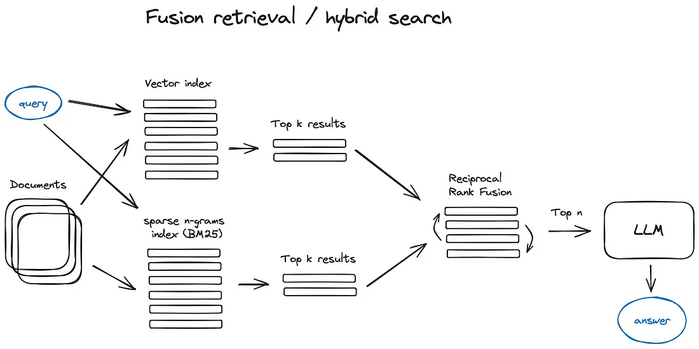
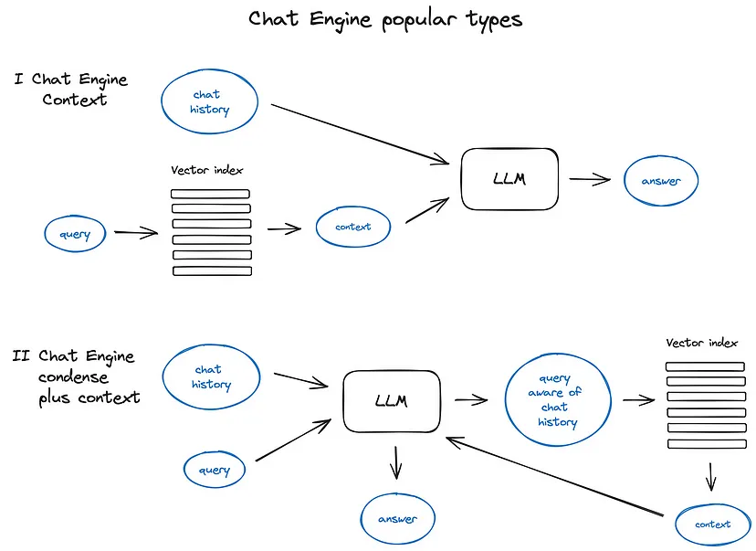

# Lesson 02: Retrieve & Generate with LlamaIndex

In this lesson, you'll:

-   Explore retrieval techniques
-   Transform the user question into an appropriate query
-   Filter and rerank nodes
-   Build a chat engine

    
    

### 🗺️ Roadmap

1. 🛠️ **Hands-on:** Load and process documents from a Wikipedia page (`11_hands_on_problem.ipynb`)
2. 🛠️ **Hands-on:** Create an index by processing the Paul Graham essay (`21_hands_on_problem.ipynb`)

## 🎓 Key Concepts

-   Retrieval techniques
-   Query transformation
-   Node filtering and reranking
-   Chat engine building

## 🚀 Open the notebooks and let's get started!
